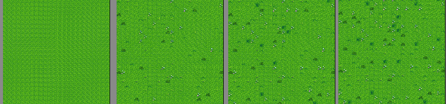

Example project for using AutoMap to randomize the light grass tiles, specificly tile 0,7 the closest plain grass tile to the top left of the tilesheet, 
targeting the outdoorsTileSheet.png
should work for any season.

## Sample Image
