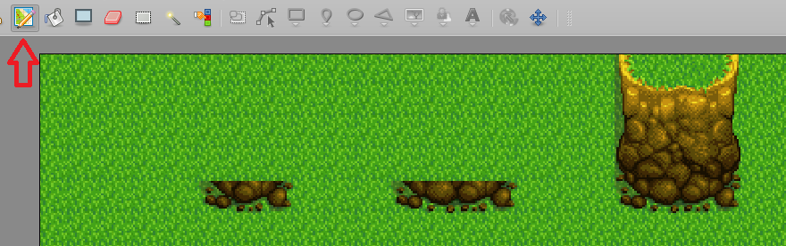

Example project for drawing the bottom of a wall on the Building Layer using terrian brushes using Tiled, 
Then using AutoMap auto-completing the rest of the wall
targeting the outdoorsTileSheet.png
should work for any season.

## Sample Image
